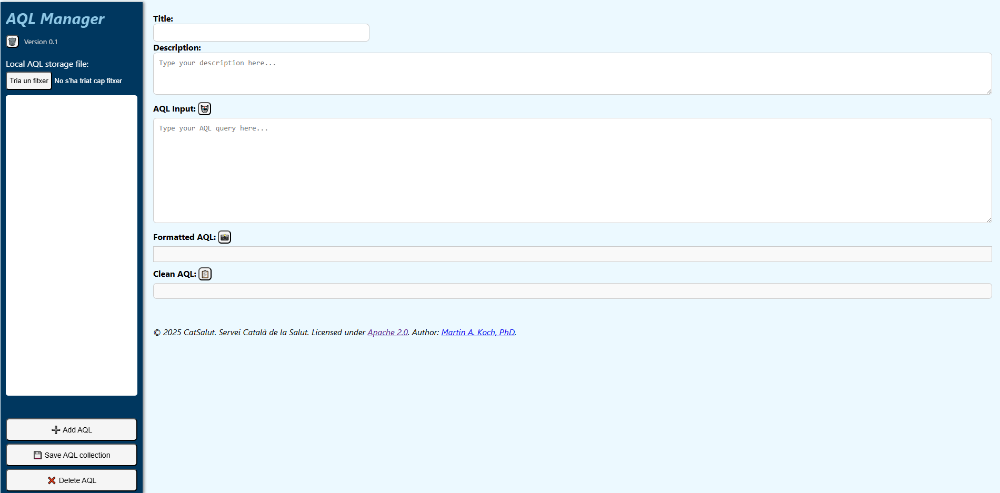
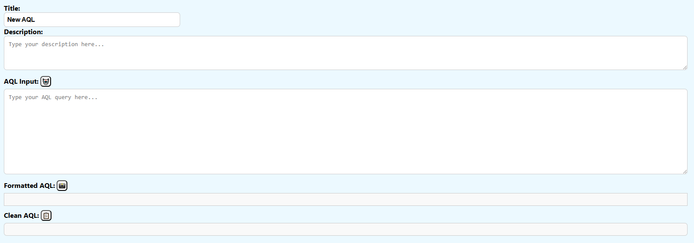
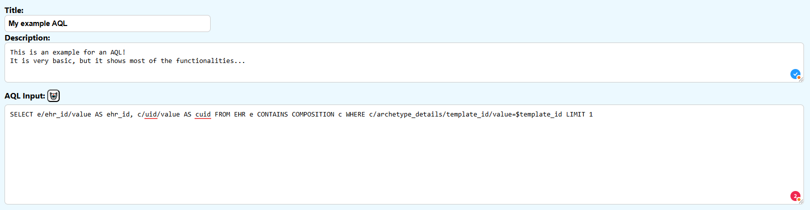
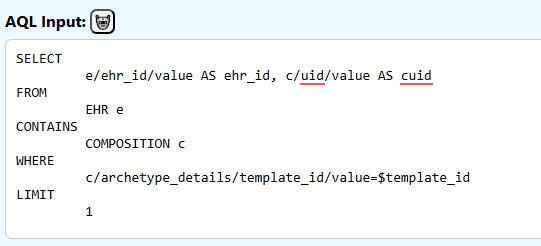
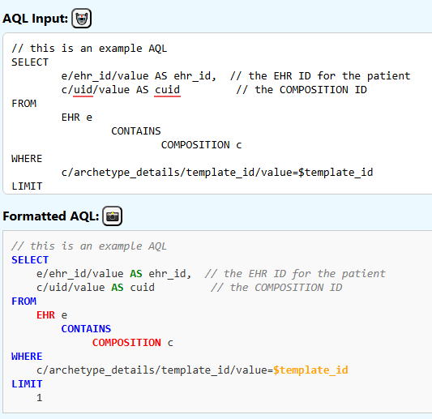
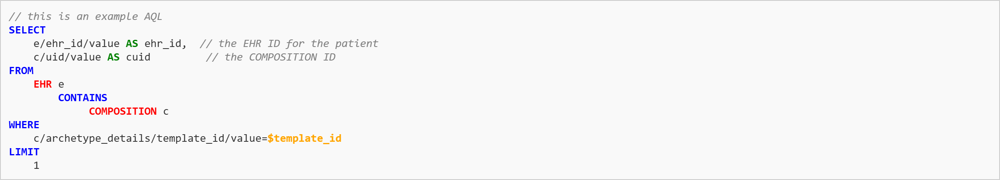
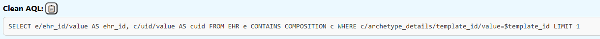
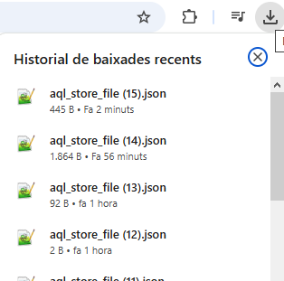
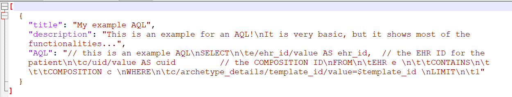

# openEHR AQL Manager

This is a proof of concept webpage that can be used to store and format openEHR compliant AQL queries.

## Precautions

💀 Reloading the HTML page might make you loose your progress. Please save often!

⚠️ Be aware that changes to your AQL collection get saved in a new file everytime you save. Be sure to keep the last downloaded file for your next session.

## GUI overview

## How to use this

### Starting from scratch
### Adding an AQL
Press the "Add AQL" button to add a new AQL to the list

You get a new empty AQL.

Change the title, the description and finally add your AQL to the "AQL Input".

You can format your AQL input with line breaks, spaces and tabs. 

You can use the auto-format button to enter automatically line breaks at the major keywords. 

#### Formatted AQL
The "Formatted AQL" section shows you a version of the input AQL with keyword highlights.

Highlighted text is:
- orange: parameters starting with "$"
- blue: ['SELECT',  'FROM', 'CONTAINS', 'WHERE', 'ORDER BY', 'LIMIT', 'OFFSET', 'NOT', 'LIKE', 'matches', 'exists', '<', '>', '=', '!', 'true', 'false', 'NULL']
- red: ['VERSION','EHR', 'CONTENT_ITEM', 'ENTRY', 'CARE_ENTRY', 'EVENT', 'ITEM_STRUCTURE', 'ITEM', 'COMPOSITION', 'FOLDER', 'EHR_STATUS', 'EVENT_CONTEXT', 'SECTION', 'GENERIC_ENTRY', 'ADMIN_ENTRY', 'OBSERVATION', 'INSTRUCTION', 'ACTION', 'EVALUATION', 'ACTIVITY', 'HISTORY', 'POINT_EVENT', 'INTERVAL_EVENT', 'FEEDER_AUDIT', 'ITEM_LIST', 'ITEM_SINGLE', 'ITEM_TABLE', 'ITEM_TREE', 'CLUSTER', 'ELEMENT']
- green: ['DESC','ASC','AS','DISTINCT', 'AND', 'OR']
- gray: in line comments that start with "//"

This view of the AQL can be exported as a PNG file. Press the snapshot button:

Automatically the image gets downloaded as "formatted_aql.png".

Example of an image exported:

#### Clean AQL
For many applications an AQL without line breaks, tabs or comments is needed. Therefore we present a cleaned up version in the "Clean AQL" section:

This AQL can be copied to the clipborad by pressing the "copy to clipboard" button:

### Delete an AQL
To delete an AQL from the collection, select the AQL you want to delete in the list on the left hand side.

Press the "Delete AQL" button to delete the AQL:

### Changing an AQL
To modify an AQL, select the AQL you want to delete in the list on the left hand side.

When an AQL is selected you can make changes to the title, description and input.

Don't forget to save the selection after making changes.  

### Starting with an AQL collection
Instead of starting from scratch, you can load a JSON file with an AQL collection. Use the "Select file" button to do so:

### Saving the AQL collection
Use the "Save AQL collection" button to download the whole AQL collection:

The whole AQL selection gets saved in a "aql_store_file.json" file. If this file already exists, a new file with "(N)" added to the name:

⚠️The save button does not "update" a local file selected previsously. Be sure to save the downloaded AQL collection for a future session.

The format of the saved file is a list of elements that have 3 attributes: title, description and AQL:

### Deleting the local browser storage
The webpage uses the local storage of the web browser, so nothing gets lost when you close or reload the page. 
If you want to delete the AQL data in local storage, you can do so with the "Clear Local Storage" button:

## License
© CatSalut. Servei Català de la Salut. Licensed under Apache 2.0. Author: Martin A. Koch, PhD.